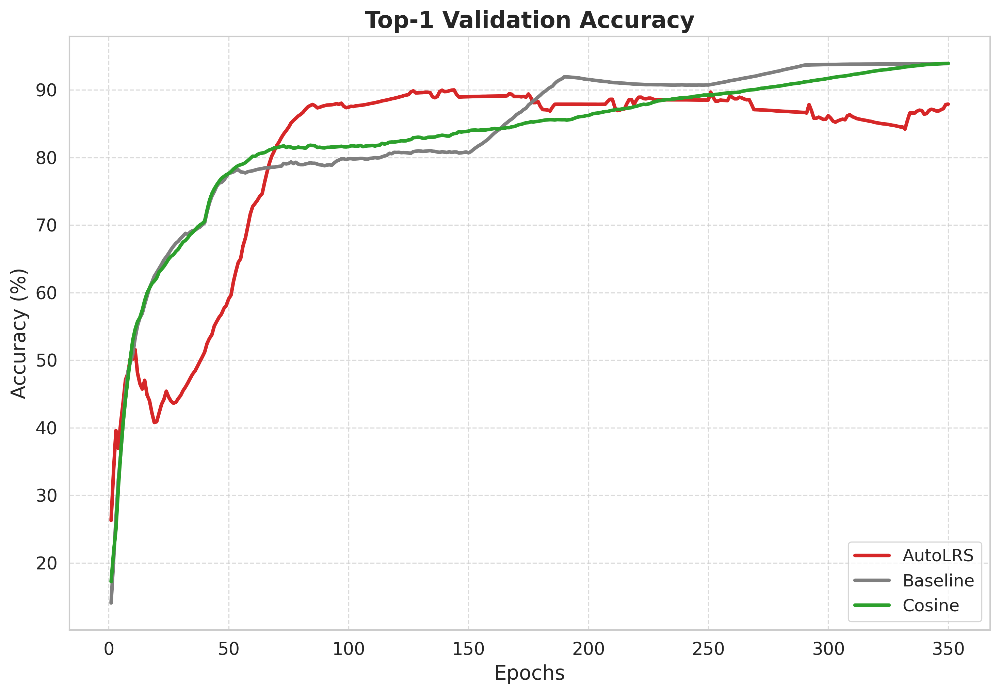
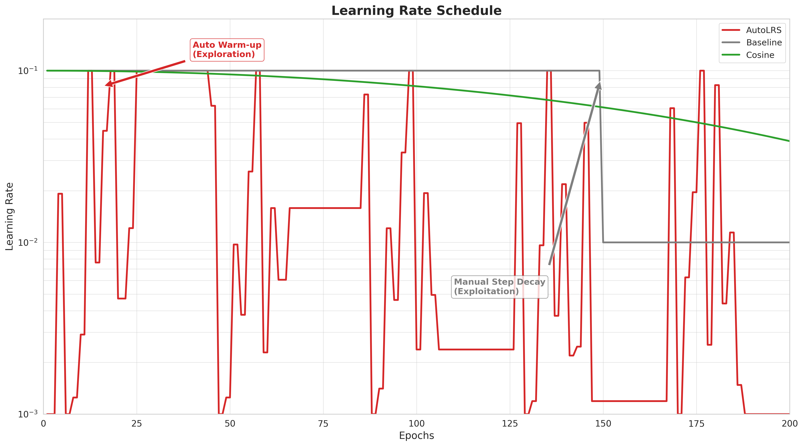
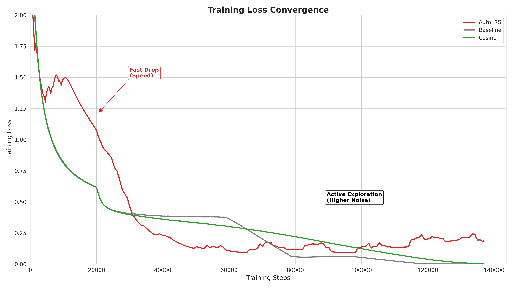

# AutoLRS Demo

Demo so sánh hiệu quả của **AutoLRS** (Automatic Learning Rate Scheduler) với các phương pháp truyền thống trên bài toán phân loại ảnh CIFAR-10 sử dụng mô hình VGG16.

## Tham khảo

- **Paper gốc:** https://github.com/YuchenJin/autolrs.git

> Nhóm quyết định thực nghiệm ở thư mục `/demo` riêng biệt, không phụ thuộc vào code gốc của paper. Hai file `autolrs_server.py` và `autolrs_callback.py` được copy từ paper gốc và chỉnh sửa để tương thích với Python 3.11.

## Cấu trúc thư mục

```
demo/
├── autolrs_server.py       # Server điều khiển learning rate (Bayesian Optimization)
├── autolrs_callback.py     # Callback kết nối training với server
├── train_reproduce.py      # Train với AutoLRS (phương pháp đề xuất)
├── train_baseline_paper.py # Train với MultiStepLR (baseline)
├── train_cosine_paper.py   # Train với CosineAnnealingLR
├── plot_figure_1.py        # Vẽ biểu đồ Accuracy & Learning Rate
├── plot_figure_2.py        # Vẽ biểu đồ Training Loss
├── models/
│   └── vgg.py              # Kiến trúc VGG16
└── req_new.txt             # Dependencies
```

## Cài đặt

> **Lưu ý:** Paper gốc sử dụng Python 3.6, tuy nhiên phiên bản này đã khá cũ nên nhóm quyết định sử dụng Python 3.11.

```bash
# Clone repository
git clone <repository-url>
cd demo

# Tạo virtual environment
python3.11 -m venv venv
source venv/bin/activate

# Cài đặt dependencies
pip install -r req_new.txt
```

## Hướng dẫn chạy

### Bước 1: Khởi động AutoLRS Server

Mở **Terminal 1** và chạy:

```bash
python autolrs_server.py --min_lr 1e-4 --max_lr 0.1 --port 12315
```

Server sẽ lắng nghe kết nối từ quá trình training và tự động điều chỉnh learning rate.

### Bước 2: Train mô hình

Mở **Terminal 2** (hoặc các terminal riêng biệt) để train với 3 phương pháp khác nhau:

**Phương pháp 1: AutoLRS (Đề xuất)**
```bash
python train_reproduce.py --epochs 350 --batch-size 128 --port 12315
```

**Phương pháp 2: Baseline (MultiStepLR)**
```bash
python train_baseline_paper.py --epochs 350 --batch-size 128
```

**Phương pháp 3: Cosine Annealing**
```bash
python train_cosine_paper.py --epochs 350 --batch-size 128
```

> **Lưu ý:** Chỉ `train_reproduce.py` cần server chạy trước. Hai phương pháp còn lại chạy độc lập.

### Bước 3: Vẽ biểu đồ kết quả

Sau khi training hoàn tất, chạy các script plot:

```bash
# Vẽ biểu đồ Accuracy và Learning Rate
python plot_figure_1.py

# Vẽ biểu đồ Training Loss
python plot_figure_2.py
```

Kết quả sẽ được lưu tại:
- `plot_accuracy.png` - So sánh validation accuracy
- `plot_learning_rate.png` - So sánh learning rate schedule
- `plot_training_loss.png` - So sánh training loss convergence

## Kết quả thực nghiệm

| Phương pháp | Scheduler | Đặc điểm |
|-------------|-----------|----------|
| **AutoLRS** | Bayesian Optimization | Tự động tìm LR tối ưu, hội tụ nhanh |
| Baseline | MultiStepLR (150, 250) | Giảm LR theo epoch cố định |
| Cosine | CosineAnnealingLR | Giảm LR theo hàm cosine |

### Validation Accuracy



### Learning Rate Schedule



### Training Loss



## File Log

Quá trình training sẽ tạo ra 3 file log CSV:
- `reproduce_vgg_log.csv` - Log từ AutoLRS
- `baseline_vgg_log.csv` - Log từ Baseline
- `cosine_vgg_log.csv` - Log từ Cosine

Các script `plot_figure_1.py` và `plot_figure_2.py` sẽ đọc 3 file CSV này để vẽ các biểu đồ so sánh ở trên.
